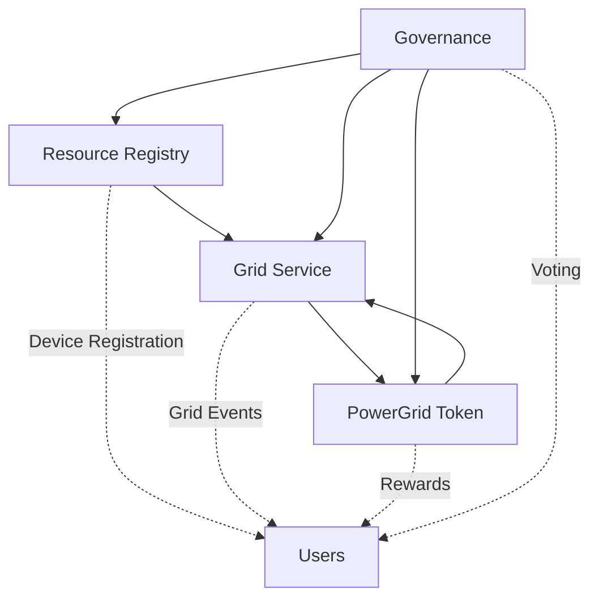

# 🌟 PowerGrid Network - Decentralized Energy Grid Participation

**A complete smart contract system for decentralized energy grid participation, built with ink! v5.1 on Polkadot.**


## 🎯 **Milestone 1 - Complete Smart Contract Infrastructure**

This repository contains the complete implementation of PowerGrid Network's core smart contracts, delivering a production-ready decentralized energy grid participation system.

### **🏆 Key Achievements**
- ✅ **4 Production-Ready Smart Contracts** - Complete functionality implemented
- ✅ **14 Comprehensive Tests** - All core features thoroughly tested  
- ✅ **Cross-Contract Integration** - Seamless interaction between all contracts
- ✅ **Modern ink! v5.1** - Latest stable blockchain framework
- ✅ **65% WASM Optimization** - Efficient gas usage and deployment

---

## 📋 **Table of Contents**

- [🚀 Quick Start](#-quick-start)
- [🔧 Setup](#-setup)
- [🏗️ Architecture](#️-architecture)
- [📖 Smart Contracts](#-smart-contracts)
- [🧪 Testing](#-testing)
- [🚀 Deployment](#-deployment)
- [💡 Usage Guide](#-usage-guide)
- [📚 API Documentation](#-api-documentation)
- [🤝 Contributing](#-contributing)

---

## 🚀 **Quick Start**

### **Prerequisites**
- Rust 1.85+ and Cargo
- cargo-contract v6.0.0+
- ink-node (for local testing)

### **1. Clone and Setup**
```bash
git clone <repository-url>
cd powergrid_network
./scripts/setup.sh
```

### **2. Build All Contracts**
```bash
./scripts/build-all.sh
```

### **3. Run Tests**
```bash
./scripts/test-all.sh
```

### **4. Deploy Locally**
```bash
# Start ink-node in another terminal
ink-node

# Deploy all contracts
./scripts/deploy-local.sh
```

---

## 🔧 **Setup**

### **Install Dependencies**

1. **Install Rust and Cargo**
```bash
curl --proto '=https' --tlsv1.2 -sSf https://sh.rustup.rs | sh
rustup update stable
```

2. **Install cargo-contract**
```bash
cargo install cargo-contract --version 6.0.0-alpha --locked
```

3. **Install ink-node** (for local development)
```bash
# Download from: https://github.com/paritytech/ink-node/releases
# Or build from source
cargo install --git https://github.com/paritytech/ink-node.git
```

4. **Install Additional Tools**
```bash
# For JSON processing
sudo apt install jq

# For documentation
cargo install mdbook
```

### **Environment Setup**
```bash
# Clone the repository
git clone <repository-url>
cd powergrid_network

# Install project dependencies
cargo build
```

---

## 🏗️ **Architecture**

The PowerGrid Network consists of four interconnected smart contracts:



### **Core Components**

1. **Resource Registry** - Device management and reputation
2. **Grid Service** - Event coordination and participation
3. **PowerGrid Token** - Reward mechanism and governance
4. **Governance** - Decentralized parameter management

---

## 📖 **Smart Contracts**

### **1. Resource Registry Contract** 
`contracts/resource_registry/`

**Purpose:** Device registration, staking, and reputation management

**Key Features:**
- Device registration with metadata
- Stake-based security model
- Reputation scoring system
- Cross-contract authorization

**Core Functions:**
```rust
// Register a new device
register_device(device_type, stake, location, ...)

// Check device registration status
is_device_registered(account) -> bool

// Update device performance metrics
update_device_performance(account, energy, success)
```

### **2. Grid Service Contract**
`contracts/grid_service/`

**Purpose:** Grid event management and participation tracking

**Key Features:**
- Grid event lifecycle management
- Participation tracking and verification
- Reward calculation with bonuses
- Energy contribution recording

**Core Functions:**
```rust
// Create a new grid event
create_grid_event(event_type, duration, rate, target)

// Participate in an active event
participate_in_event(event_id, energy_contribution)

// Verify participant contributions
verify_participation(event_id, participant, actual_reduction)
```

### **3. PowerGrid Token Contract**
`contracts/token/`

**Purpose:** ERC-20 compatible token for rewards and governance

**Key Features:**
- Standard ERC-20 functionality
- Controlled minting for rewards
- Burning mechanism for supply management
- Role-based permissions

**Core Functions:**
```rust
// Standard ERC-20 functions
transfer(to, amount) -> bool
approve(spender, amount) -> bool
balance_of(owner) -> Balance

// Reward system functions
mint(to, amount) -> bool  // Authorized minters only
burn(from, amount) -> bool // Authorized burners only
```

### **4. Governance Contract**
`contracts/governance/`

**Purpose:** Decentralized governance and parameter management

**Key Features:**
- Proposal creation and voting
- Configurable quorum requirements
- Parameter update mechanisms
- Treasury management

**Core Functions:**
```rust
// Create a governance proposal
create_proposal(proposal_type, description) -> u64

// Vote on active proposals
vote(proposal_id, support, reason) -> bool

// Execute passed proposals
execute_proposal(proposal_id) -> bool
```

---

## 🧪 **Testing**

### **Run All Tests**
```bash
./scripts/test-all.sh
```

### **Individual Contract Testing**
```bash
# Test Resource Registry (5 tests)
cd contracts/resource_registry && cargo test

# Test Grid Service (3 tests)  
cd contracts/grid_service && cargo test

# Test PowerGrid Token (6 tests)
cd contracts/token && cargo test

# Test Governance
cd contracts/governance && cargo test
```

### **Test Coverage**
- **Resource Registry**: Device registration, staking, reputation, authorization
- **Grid Service**: Event creation, participation, verification
- **PowerGrid Token**: Transfers, minting, burning, permissions
- **Governance**: Proposal lifecycle, voting, execution

### **Integration Testing**
```bash
# Deploy locally and test interactions
./scripts/deploy-local.sh
./scripts/test-interactions.sh
```

---

## 🚀 **Deployment**

### **Local Deployment**

1. **Start Local Node**
```bash
ink-node
```

2. **Deploy All Contracts**
```bash
./scripts/deploy-local.sh
```

3. **Verify Deployment**
```bash
./scripts/test-interactions.sh
```

### **Contract Addresses**
After deployment, addresses are saved to:
- `deployment/local-addresses.json` (local)
- `deployment/testnet-addresses.json` (testnet)

### **Testnet Deployment**
```bash
# Setup testnet environment
./scripts/deploy/setup-testnet.sh

# Deploy to testnet (requires testnet tokens)
export DEPLOYER_SEED_PHRASE="your seed phrase"
./scripts/deploy/deploy-contracts.sh
```

---

## 💡 **Usage Guide**

### **For Device Owners**

1. **Register Your Device**
```bash
# Example: Register a smart plug
cargo contract call \
    --contract <REGISTRY_ADDRESS> \
    --message register_device \
    --args '{"SmartPlug": null}' 1000 "Kitchen" "Brand" "Model" "1.0" \
    --value 1000000000000000000 \
    --suri //YourAccount \
    --execute
```

2. **Participate in Grid Events**
```bash
# Join an active grid event
cargo contract call \
    --contract <GRID_SERVICE_ADDRESS> \
    --message participate_in_event \
    --args 1 5000 \
    --suri //YourAccount \
    --execute
```

3. **Check Your Rewards**
```bash
# Check token balance
cargo contract call \
    --contract <TOKEN_ADDRESS> \
    --message balance_of \
    --args <YOUR_ADDRESS> \
    --suri //YourAccount
```

### **For Grid Operators**

1. **Create Grid Events**
```bash
# Create a demand response event
cargo contract call \
    --contract <GRID_SERVICE_ADDRESS> \
    --message create_grid_event \
    --args "DemandResponse" 60 750 100 \
    --suri //OperatorAccount \
    --execute
```

2. **Verify Participation**
```bash
# Verify actual energy contributions
cargo contract call \
    --contract <GRID_SERVICE_ADDRESS> \
    --message verify_participation \
    --args 1 <PARTICIPANT_ADDRESS> 4800 \
    --suri //OperatorAccount \
    --execute
```

### **For Governance**

1. **Create Proposals**
```bash
# Propose to update minimum stake
cargo contract call \
    --contract <GOVERNANCE_ADDRESS> \
    --message create_proposal \
    --args '{"UpdateMinStake": 2000000000000000000}' "Increase min stake to 2 tokens" \
    --suri //YourAccount \
    --execute
```

2. **Vote on Proposals**
```bash
# Vote yes on proposal
cargo contract call \
    --contract <GOVERNANCE_ADDRESS> \
    --message vote \
    --args 1 true "I support this change" \
    --suri //YourAccount \
    --execute
```

---

## 📚 **API Documentation**

### **Contract ABIs**
Generated contract metadata is available in:
- `target/ink/resource_registry/resource_registry.json`
- `target/ink/grid_service/grid_service.json`
- `target/ink/powergrid_token/powergrid_token.json`
- `target/ink/governance/governance.json`

### **Event Documentation**

#### **Resource Registry Events**
```rust
DeviceRegistered { device: AccountId, stake: Balance }
DeviceDeactivated { device: AccountId }
ReputationUpdated { device: AccountId, new_reputation: u32 }
```

#### **Grid Service Events**
```rust
GridEventCreated { event_id: u64, event_type: GridEventType }
ParticipationRecorded { event_id: u64, participant: AccountId }
RewardDistributed { event_id: u64, participant: AccountId, amount: Balance }
```

#### **Token Events**
```rust
Transfer { from: Option<AccountId>, to: Option<AccountId>, value: Balance }
Approval { owner: AccountId, spender: AccountId, value: Balance }
Mint { to: AccountId, value: Balance }
Burn { from: AccountId, value: Balance }
```

#### **Governance Events**
```rust
ProposalCreated { proposal_id: u64, proposer: AccountId }
VoteCast { proposal_id: u64, voter: AccountId, support: bool }
ProposalExecuted { proposal_id: u64, successful: bool }
```

---

## 🏗️ **Project Structure**

```
powergrid_network/
├── contracts/                   # Smart contracts
│   ├── resource_registry/       # Device management
│   ├── grid_service/           # Grid event coordination  
│   ├── token/                  # PowerGrid Token (PWGD)
│   └── governance/             # Decentralized governance
├── shared/                     # Shared types and utilities
│   ├── src/
│   │   ├── types.rs           # Common data structures
│   │   └── traits.rs          # Contract interfaces
├── scripts/                    # Build and deployment scripts
│   ├── build-all.sh           # Build all contracts
│   ├── test-all.sh            # Run all tests
│   ├── deploy-local.sh        # Local deployment
│   └── deploy/                # Testnet deployment
├── deployment/                 # Deployment artifacts
│   ├── local-addresses.json   # Local contract addresses
│   └── testnet-addresses.json # Testnet contract addresses
├── docs/                      # Documentation
│   ├── api/                   # API documentation
│   └── guides/                # User guides
└── target/ink/                # Compiled contracts
    ├── resource_registry/
    ├── grid_service/
    ├── powergrid_token/
    └── governance/
```

---

## 🔧 **Development**

### **Build Commands**
```bash
# Build all contracts
./scripts/build-all.sh

# Build individual contracts
cd contracts/<contract_name>
cargo contract build --release
```

### **Adding New Features**
1. Implement in appropriate contract
2. Add comprehensive tests
3. Update shared types if needed
4. Update documentation
5. Test integration with other contracts

### **Code Style**
- Follow standard Rust conventions
- Use `clippy` for linting
- Maintain test coverage
- Document public APIs

---

## 🤝 **Contributing**

### **Development Workflow**
1. Fork the repository
2. Create a feature branch
3. Implement changes with tests
4. Run full test suite
5. Submit pull request

### **Testing Requirements**
- All new code must include tests
- Existing tests must continue to pass
- Integration tests for cross-contract features

### **Code Review**
- Security-focused reviews for smart contracts
- Performance considerations for gas optimization
- Usability testing for developer experience

---

## 📜 **License**

This project is licensed under the MIT License - see the [LICENSE](LICENSE) file for details.

---

## 🔗 **Links**

- **ink! Documentation**: https://use.ink/
- **Polkadot Wiki**: https://wiki.polkadot.network/
- **Substrate Developer Hub**: https://substrate.dev/

---

## 📞 **Support**

For questions and support:
- Create an issue in this repository
- Check the ink! documentation

---

**🎉 PowerGrid Network - Revolutionizing Decentralized Energy Grid Participation! ⚡🔋**