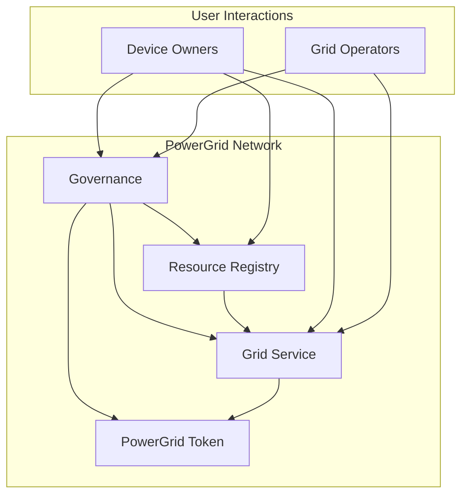

# PowerGrid Network

A decentralized energy grid management system built with ink! smart contracts on Substrate.

## Overview

PowerGrid Network enables:
- **Token-based rewards** for grid participants
- **Device registration** and verification
- **Grid event management** (demand response, load balancing)
- **Decentralized governance** for network parameters

## Quick Start with Docker

### Prerequisites
- Docker and Docker Compose
- Git

### Setup

1. **Clone the repository**
   ```bash
   git clone <repository-url>
   cd powergrid_network
   ```

2. **Build the Docker environment**
   ```bash
   docker-compose build
   ```

3. **Start the substrate node**
   ```bash
   docker-compose up -d node
   ```

4. **Run unit tests**
   ```bash
   docker-compose run --rm tester cargo test --workspace
   ```

5. **Run E2E tests** (requires running node)
   ```bash
   docker-compose run --rm tester cargo test --features e2e-tests
   ```

6. **Deploy contracts**
   ```bash
   docker-compose run --rm tester ./scripts/deploy-local.sh
   ```

This repository contains the complete implementation of PowerGrid Network's core smart contracts, delivering a production-ready decentralized energy grid participation system.

### **🏆 Key Achievements**
- ✅ **4 Production-Ready Smart Contracts** - Complete functionality implemented
- ✅ **14 Comprehensive Tests** - All core features thoroughly tested  
- ✅ **Cross-Contract Integration** - Seamless interaction between all contracts
- ✅ **Modern ink! v5.1** - Latest stable blockchain framework
- ✅ **65% WASM Optimization** - Efficient gas usage and deployment

---

## 📋 **Table of Contents**

- [🚀 Quick Start](#-quick-start)
- [🔧 Setup](#-setup)
- [🗜️ Architecture](#️-architecture)
- [📖 Smart Contracts](#-smart-contracts)
- [🧪 Testing](#-testing)
- [🚀 Deployment](#-deployment)
- [🌐 Live Testnet Deployment](#-live-testnet-deployment)
- [💡 Usage Guide](#-usage-guide)
- [📚 API Documentation](#-api-documentation)
- [🗜️ Project Structure](#️-project-structure)
- [🔧 Development](#-development)
- [🤝 Contributing](#-contributing)

---

## 🚀 **Quick Start**

> 📘 Looking for detailed OS-specific setup instructions and Docker usage? See [`docs/setup-and-testing.md`](docs/setup-and-testing.md).

### **Prerequisites**
- Rust 1.86.0 toolchain (via rustup)
- cargo-contract v5.0.1
- Substrate Contracts Node v0.42.0 (for local testing)

### **1. Clone and Setup**
```bash
git clone https://github.com/kunal-drall/powergrid_network.git
cd powergrid_network
./scripts/setup.sh
```

### **2. Build All Contracts**
```bash
./scripts/build-all.sh
```

### **3. Run Tests**
```bash
./scripts/test-all.sh
```

### **4. Deploy Locally**
```bash
# Start substrate-contracts-node in another terminal
substrate-contracts-node --dev

# Deploy all contracts
./scripts/deploy-local.sh
```

The script will deploy all contracts and save their addresses to `deployment/local-addresses.json`.

---

## 🔧 **Setup**

### **Install Dependencies**

1. **Install Rust and Cargo**
```bash
curl --proto '=https' --tlsv1.2 -sSf https://sh.rustup.rs | sh
rustup toolchain install 1.86.0 --profile minimal
rustup component add rust-src --toolchain 1.86.0
rustup component add clippy --toolchain 1.86.0
rustup target add wasm32-unknown-unknown --toolchain 1.86.0
```

2. **Install cargo-contract**
```bash
cargo install cargo-contract --version 5.0.1 --force --locked
```

3. **Install Substrate Contracts Node** (for local development)
```bash
# Download from: https://github.com/paritytech/substrate-contracts-node/releases
# Or build from source
cargo install contracts-node --git https://github.com/paritytech/substrate-contracts-node.git --force --locked
```

4. **Install Additional Tools**
```bash
# For JSON processing
sudo apt install jq

# For documentation
cargo install mdbook
```

### **Environment Setup**
```bash
# Clone the repository
git clone https://github.com/kunal-drall/powergrid_network.git
cd powergrid_network

# Ensure the ink! toolchain is used for contract builds
export WASM_BUILD_TOOLCHAIN=1.86.0

# Install project dependencies
cargo build
```

---

## 🗜️ **Architecture**

The PowerGrid Network consists of four interconnected smart contracts:



### **Core Components**

1. **PowerGrid Token ($PWGD)** - PSP22-compliant token for rewards and staking
2. **Resource Registry** - Device management, staking, and reputation system
3. **Grid Service** - Event coordination and participation tracking
4. **Governance** - Decentralized parameter management and voting

---

## 📖 **Smart Contracts**

### **1. Resource Registry Contract** 
`contracts/resource_registry/`

**Purpose:** Device registration, staking, and reputation management

**Key Features:**
- Device registration with comprehensive metadata
- Stake-based security model
- Reputation scoring system
- Cross-contract authorization

**Core Functions:**
```rust
// Register a new device with stake
register_device(device_type, stake, location, manufacturer, model, firmware_version, installation_date)

// Check device registration status
is_device_registered(account) -> bool

// Update device performance metrics
update_device_performance(account, energy, success)

// Check device reputation
get_device_reputation(account) -> u32
```

### **2. Grid Service Contract**
`contracts/grid_service/`

**Purpose:** Grid event management and participation tracking

**Key Features:**
- Grid event lifecycle management (DemandResponse, LoadBalancing, FrequencyRegulation)
- Participation tracking and verification
- Reward calculation with performance bonuses
- Energy contribution recording

**Core Functions:**
```rust
// Create a new grid event
create_grid_event(event_type, duration_minutes, reward_rate, target_reduction)

// Participate in an active event
participate_in_event(event_id, energy_contribution)

// Verify participant contributions
verify_participation(event_id, participant, actual_reduction)

// Get active events
get_active_events() -> Vec<GridEvent>
```

### **3. PowerGrid Token Contract**
`contracts/token/`

**Purpose:** PSP22-compliant token for rewards and governance

**Key Features:**
- Standard PSP22 functionality
- Controlled minting for rewards
- Burning mechanism for supply management
- Role-based permissions system

**Core Functions:**
```rust
// Standard PSP22 functions
transfer(to, amount) -> bool
approve(spender, amount) -> bool
balance_of(owner) -> Balance
total_supply() -> Balance

// Reward system functions
mint(to, amount) -> bool  // Authorized minters only
burn(from, amount) -> bool // Authorized burners only
```

### **4. Governance Contract**
`contracts/governance/`

**Purpose:** Decentralized governance and parameter management

**Key Features:**
- Proposal creation and voting system
- Configurable quorum requirements
- Parameter update mechanisms
- Treasury management

**Core Functions:**
```rust
// Create a governance proposal
create_proposal(proposal_type, description) -> u64

// Vote on active proposals
vote(proposal_id, support, reason) -> bool

// Execute passed proposals
execute_proposal(proposal_id) -> bool

// Get proposal status
get_proposal(proposal_id) -> Proposal
```

---

## 🧪 **Testing**

### **Run All Tests**
```bash
./scripts/test-all.sh
```

### **Individual Contract Testing**
```bash
# Test Resource Registry (5 tests)
cd contracts/resource_registry && cargo test

# Test Grid Service (3 tests)  
cd contracts/grid_service && cargo test

# Test PowerGrid Token (6 tests)
cd contracts/token && cargo test

# Test Governance
cd contracts/governance && cargo test
```

### **Test Coverage**
- **Resource Registry**: Device registration, staking, reputation, authorization
- **Grid Service**: Event creation, participation, verification, reward calculation
- **PowerGrid Token**: Transfers, minting, burning, permissions, supply management
- **Governance**: Proposal lifecycle, voting mechanics, execution, quorum handling

### **Integration Testing**
```bash
# Deploy locally and test interactions
./scripts/deploy-local.sh
./scripts/test-interactions.sh
```

---

## 🚀 **Deployment**

### **Local Deployment**

1. **Start Local Node**
```bash
substrate-contracts-node --dev
```

2. **Deploy All Contracts**
```bash
./scripts/deploy-local.sh
```

3. **Verify Deployment**
```bash
./scripts/test-interactions.sh
```

### **Contract Addresses**
After deployment, addresses are saved to:
- `deployment/local-addresses.json` (local)
- `deployment/testnet-addresses.json` (testnet)

### **Testnet Deployment**
```bash
# Setup testnet environment
./scripts/deploy/setup-testnet.sh

# Deploy to testnet (requires testnet tokens)
export DEPLOYER_SEED_PHRASE="your seed phrase"
./scripts/deploy/deploy-contracts.sh
```

---

## 🌐 **Live Testnet Deployment**

The PowerGrid Network is currently live on the POP Network Testnet. You can interact with the deployed contracts using the addresses below.

### **Contract Addresses**

| Contract | Address |
|----------|---------|
| Token | `5HcecRAGodKw4t2sDYWzMws5rsggzxUXvtiS2CapJTLZxQ8n` |
| Resource Registry | `5F2edUrKTZ67sWAB2GEUdvM1oqyH5Vj6W8wK5GDWsLPTR6sA` |
| Grid Service | `5DLdkNW2aLGvpSvp31pd2f62m9bJNomMEAFAdpsP7RFjWms3` |
| Governance | `5E6Yw6XQGw2sspe4xnisUot5HGRhqTFELWs6vfQJPW8YAjcE` |

A JSON file with these addresses is also available at `deployment/testnet-addresses.json`.

---

## 💡 **Usage Guide**

### **Environment Setup for Testnet Interaction**

Set up your environment variables for convenience:

```bash
# Your secret seed phrase (e.g., from Subwallet or Talisman)
export SEED_PHRASE="your twelve word seed phrase here"

# The RPC endpoint for the testnet
export RPC_URL="wss://rpc1.paseo.popnetwork.xyz/"

# Contract Addresses
export TOKEN_ADDR="5HcecRAGodKw4t2sDYWzMws5rsggzxUXvtiS2CapJTLZxQ8n"
export REGISTRY_ADDR="5F2edUrKTZ67sWAB2GEUdvM1oqyH5Vj6W8wK5GDWsLPTR6sA"
export GRID_ADDR="5DLdkNW2aLGvpSvp31pd2f62m9bJNomMEAFAdpsP7RFjWms3"
export GOVERNANCE_ADDR="5E6Yw6XQGw2sspe4xnisUot5HGRhqTFELWs6vfQJPW8YAjcE"
```

### **For Device Owners**

#### **1. Register Your Device**
```bash
# From the project root, navigate to the contract directory
cd contracts/resource_registry

# Register a SmartPlug device with stake
cargo contract call \
  --contract $REGISTRY_ADDR \
  --message register_device \
  --args '{"SmartPlug": null}' 2000 "Living Room" "PowerGrid Inc" "SmartNode-1" "1.0" 1754580839000 \
  --value 100000000000000000000 \
  --url $RPC_URL \
  --suri "$SEED_PHRASE" \
  --execute
```

#### **2. Check Registration Status**
```bash
cargo contract call \
  --contract $REGISTRY_ADDR \
  --message is_device_registered \
  --args <YOUR_ADDRESS> \
  --url $RPC_URL \
  --suri "$SEED_PHRASE"
```

#### **3. Participate in Grid Events**
```bash
# Navigate to grid service contract directory
cd ../grid_service

# Join an active grid event
cargo contract call \
  --contract $GRID_ADDR \
  --message participate_in_event \
  --args 1 5000 \
  --url $RPC_URL \
  --suri "$SEED_PHRASE" \
  --execute
```

#### **4. Check Your Rewards**
```bash
# Navigate to token contract directory
cd ../token

# Check token balance
cargo contract call \
  --contract $TOKEN_ADDR \
  --message balance_of \
  --args <YOUR_ADDRESS> \
  --url $RPC_URL \
  --suri "$SEED_PHRASE"
```

### **For Grid Operators**

#### **1. Create Grid Events**
```bash
# Navigate to the grid service directory
cd contracts/grid_service

# Create a "DemandResponse" event
cargo contract call \
  --contract $GRID_ADDR \
  --message create_grid_event \
  --args "DemandResponse" 60 750 100 \
  --url $RPC_URL \
  --suri "$SEED_PHRASE" \
  --execute
```

#### **2. Verify Participation**
```bash
# Verify actual energy contributions
cargo contract call \
  --contract $GRID_ADDR \
  --message verify_participation \
  --args 1 <PARTICIPANT_ADDRESS> 4800 \
  --url $RPC_URL \
  --suri "$SEED_PHRASE" \
  --execute
```

### **For Governance Participation**

#### **1. Create Proposals**
```bash
# Navigate to governance directory
cd contracts/governance

# Propose to update minimum stake
cargo contract call \
  --contract $GOVERNANCE_ADDR \
  --message create_proposal \
  --args '{"UpdateMinStake": 2000000000000000000}' "Increase min stake to 2 tokens" \
  --url $RPC_URL \
  --suri "$SEED_PHRASE" \
  --execute
```

#### **2. Vote on Proposals**
```bash
# Vote yes on proposal
cargo contract call \
  --contract $GOVERNANCE_ADDR \
  --message vote \
  --args 1 true "I support this change" \
  --url $RPC_URL \
  --suri "$SEED_PHRASE" \
  --execute
```

---

## 📚 **API Documentation**

### **Contract ABIs**
Generated contract metadata is available in:
- `target/ink/resource_registry/resource_registry.json`
- `target/ink/grid_service/grid_service.json`
- `target/ink/powergrid_token/powergrid_token.json`
- `target/ink/governance/governance.json`

### **Event Documentation**

#### **Resource Registry Events**
```rust
DeviceRegistered { device: AccountId, stake: Balance, device_type: DeviceType }
DeviceDeactivated { device: AccountId }
ReputationUpdated { device: AccountId, new_reputation: u32 }
StakeUpdated { device: AccountId, new_stake: Balance }
```

#### **Grid Service Events**
```rust
GridEventCreated { event_id: u64, event_type: GridEventType, duration: u64 }
ParticipationRecorded { event_id: u64, participant: AccountId, energy_contribution: u64 }
ParticipationVerified { event_id: u64, participant: AccountId, actual_reduction: u64 }
RewardDistributed { event_id: u64, participant: AccountId, amount: Balance }
```

#### **Token Events**
```rust
Transfer { from: Option<AccountId>, to: Option<AccountId>, value: Balance }
Approval { owner: AccountId, spender: AccountId, value: Balance }
Mint { to: AccountId, value: Balance }
Burn { from: AccountId, value: Balance }
```

#### **Governance Events**
```rust
ProposalCreated { proposal_id: u64, proposer: AccountId, proposal_type: ProposalType }
VoteCast { proposal_id: u64, voter: AccountId, support: bool, voting_power: Balance }
ProposalExecuted { proposal_id: u64, successful: bool }
QuorumReached { proposal_id: u64 }
```

---

## 🗜️ **Project Structure**

```
powergrid_network/
├── contracts/                   # Smart contracts
│   ├── resource_registry/       # Device management
│   ├── grid_service/           # Grid event coordination  
│   ├── token/                  # PowerGrid Token (PWGD)
│   └── governance/             # Decentralized governance
├── contracts/powergrid_shared/  # Shared types and utilities
│   ├── src/
│   │   ├── types.rs           # Common data structures
│   │   └── traits.rs          # Contract interfaces
├── scripts/                    # Build and deployment scripts
│   ├── build-all.sh           # Build all contracts
│   ├── test-all.sh            # Run all tests
│   ├── deploy-local.sh        # Local deployment
│   └── deploy/                # Testnet deployment
├── deployment/                 # Deployment artifacts
│   ├── local-addresses.json   # Local contract addresses
│   └── testnet-addresses.json # Testnet contract addresses
├── docs/                      # Documentation
│   ├── api/                   # API documentation
│   └── guides/                # User guides
└── target/ink/                # Compiled contracts
    ├── resource_registry/
    ├── grid_service/
    ├── powergrid_token/
    └── governance/
```

---

## 🔧 **Development**

### **Build Commands**
```bash
# Build all contracts
./scripts/build-all.sh

# Build individual contracts
cd contracts/<contract_name>
cargo contract build --release
```

### **Adding New Features**
1. Implement in appropriate contract
2. Add comprehensive tests
3. Update shared types if needed
4. Update documentation
5. Test integration with other contracts

### **Code Style**
- Follow standard Rust conventions
- Use `clippy` for linting: `cargo clippy --all-targets --all-features`
- Maintain test coverage above 80%
- Document all public APIs with rustdoc
- Format code with `cargo fmt`

### **Performance Optimization**
- Monitor gas usage with `cargo contract build --release`
- Profile contract size and optimize for WASM deployment
- Use efficient data structures for storage
- Minimize cross-contract calls

---

## 🤝 **Contributing**

### **Development Workflow**
1. Fork the repository
2. Create a feature branch (`git checkout -b feature/amazing-feature`)
3. Implement changes with comprehensive tests
4. Run full test suite (`./scripts/test-all.sh`)
5. Submit pull request with detailed description

### **Testing Requirements**
- All new code must include unit tests
- Integration tests for cross-contract features
- Existing tests must continue to pass
- Minimum 80% code coverage

### **Code Review Process**
- Security-focused reviews for smart contracts
- Performance considerations for gas optimization
- Usability testing for developer experience
- Documentation review for API changes

### **Issue Reporting**
- Use GitHub issues for bug reports
- Include reproduction steps and environment details
- Tag issues appropriately (bug, enhancement, documentation)

---

## 📜 **License**

This project is licensed under the **MIT License** - see the [LICENSE](LICENSE) file for details.

---

## 🔗 **Links**

- **ink! Documentation**: https://use.ink/
- **Polkadot Wiki**: https://wiki.polkadot.network/
- **Substrate Developer Hub**: https://substrate.dev/
- **POP Network Testnet**: https://popnetwork.xyz/

---

## 📞 **Support**

For questions and support:
- Create an issue in this repository
- Check the ink! documentation


- Join the Polkadot technical community

---

**🎉 PowerGrid Network - Revolutionizing Decentralized Energy Grid Participation! ⚡🔋**
